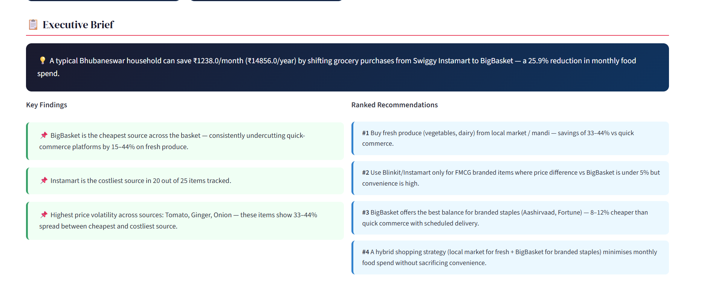
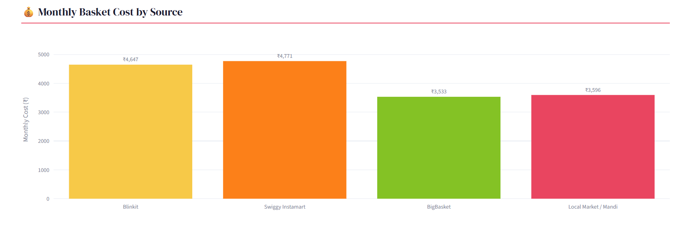
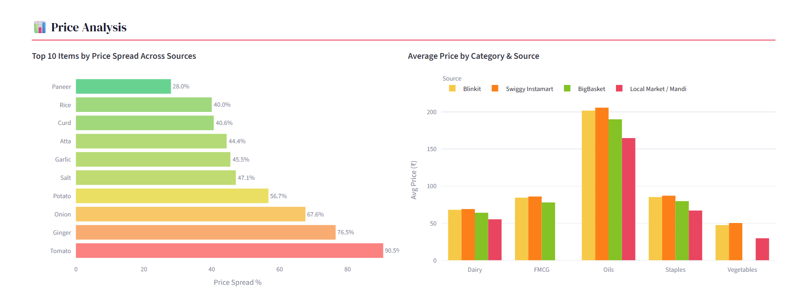
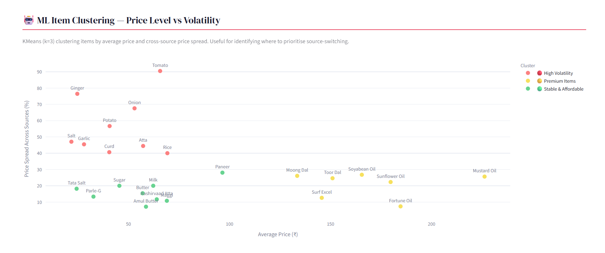

# Bhubaneswar Retail Price Intelligence

**₹14,856/year saving opportunity identified for a middle-income Bhubaneswar household** — by comparing grocery prices across 4 sources and ranking where to buy each item.

**[▶ Live Dashboard](https://bappaneswar-price-intelligence.streamlit.app/)** · Built by [Kavyanjali Karan](https://linkedin.com/in/kavyanjali-karan) · April 2026

---

## The Problem

Middle-income households in Bhubaneswar shop across Blinkit, Swiggy Instamart, BigBasket, and local mandi — but have no structured way to compare prices or quantify how much they overpay by defaulting to convenience apps.

This project self-collected prices for 25 grocery items across all 4 sources and built a dashboard that tells any household exactly where to shop and how much they'll save.

---

## Business Questions

This analysis was designed to answer the following questions:

1. Which grocery source offers the lowest overall basket cost?
2. How much can a typical household save by optimizing purchasing decisions?
3. Which items exhibit the greatest price volatility across sources?
4. Which categories should consumers prioritize for comparison shopping?
5. What purchasing strategy minimizes annual grocery expenditure while maintaining convenience?

---

## Key Findings

| Metric | Result |
|---|---|
| Monthly saving opportunity | **₹1,238/month** |
| Annual saving opportunity | **₹14,856/year** |
| Saving as % of food spend | **25.9%** |
| Cheapest source overall | Local Market / Mandi (cheapest in 18/25 items) |
| Most expensive source | Swiggy Instamart (most expensive in 20/25 items, avg 31.9% premium) |
| Highest price volatility | Tomato (44%) · Onion (38%) · Ginger (37%) |

**Headline:** The same 18-item basket costs ₹4,771 on Swiggy Instamart and ₹3,533 on BigBasket — a ₹1,238/month gap for identical groceries.

---

## Dashboard Preview

### Executive Summary



### Basket Cost Comparison



### Category Analysis



### ML Clustering



---

## Dashboard — 6 Views

1. **KPI Cards** — Monthly saving, annual saving, cheapest/costliest source at a glance
2. **Executive Brief** — Ranked findings and recommendations, auto-generated
3. **Basket Cost Comparison** — Total monthly spend by source for the 18-item household basket
4. **Price Spread Chart** — Cross-source price range per item, sorted by volatility
5. **Category Breakdown** — Average price per category per source
6. **ML Cluster Scatter** — Items grouped by price level and volatility (KMeans k=3)

---

## ML Component

KMeans (k=3) clusters all 25 items by average price and cross-source price spread (proxy for volatility and switching opportunity):

| Cluster | Items | Implication |
|---|---|---|
| High Volatility | Fresh vegetables | Highest switching benefit — always check mandi first |
| Premium | Oils, pulses | Moderate benefit — BigBasket usually wins |
| Stable | Salt, sugar, FMCG | Low benefit — buy anywhere convenient |

---

## Business Recommendation (Ranked)

1. **Fresh produce from local mandi** — 33–44% cheaper than quick commerce
2. **FMCG branded items from Blinkit/Instamart** — price gap vs BigBasket < 5%, convenience high
3. **Branded staples from BigBasket** — 8–12% cheaper than quick commerce for scheduled delivery
4. **Hybrid strategy** (mandi for fresh + BigBasket for branded) minimises spend without sacrificing convenience

---

## Data Collection

Prices collected manually from Blinkit, Swiggy Instamart, and BigBasket apps (Bhubaneswar delivery zones) and local mandi observation — April 2026. All values are midpoints of observed price ranges.

---
## Methodology

1. Collected prices for 25 grocery items across:
   - Blinkit
   - Swiggy Instamart
   - BigBasket
   - Local Mandi

2. Standardized units and item definitions.

3. Calculated:
   - Basket cost
   - Source-wise price premiums
   - Price spread
   - Monthly and annual savings

4. Applied KMeans clustering using:
   - Average item price
   - Cross-source price spread

5. Generated executive recommendations based on savings potential.

---

## Key KPIs

| KPI | Definition |
|-------|------------|
| Monthly Saving Opportunity | Difference between highest-cost and optimized basket |
| Annual Saving Opportunity | Monthly saving × 12 |
| Price Premium | Additional cost paid compared to cheapest source |
| Basket Cost | Total spend for the defined household basket |
| Price Spread | Max Price − Min Price across sources |
| Volatility % | Price Spread / Average Price |

---

## Business Impact

This project demonstrates how pricing intelligence can support:

- Consumer spending optimization
- Retail competitive benchmarking
- Category pricing strategy
- Dynamic pricing analysis
- Hyperlocal market intelligence

The framework can be extended to hundreds of products and multiple cities to support retailer pricing decisions at scale.

---

## Project Structure

```
## Project Structure

bhubaneswar-price-intelligence/
│
├── app.py
├── analytics.py
├── generate_brief.py
├── requirements.txt
├── README.md
│
├── data/
│   └── prices.py
│
├── outputs/
│   └── bhubaneswar_price_brief.pdf
│
└── screenshots/
    ├── dashboard_home.png
    ├── executive_brief.png
    ├── basket_view.png
    ├── category_view.png
    └── clustering_view.png

```

---

## Future Enhancements

- Automated daily price scraping
- Historical price tracking
- Seasonal trend analysis
- City-to-city comparisons
- Demand forecasting
- Price anomaly detection
- Retailer recommendation engine

---

## Resume Highlights

- Collected and analyzed grocery prices across 4 retail channels
- Built price intelligence dashboard using Streamlit and Plotly
- Quantified ₹14,856 annual household savings opportunity
- Applied KMeans clustering to segment products by volatility and switching potential
- Automated executive insight generation through Python analytics pipeline

---

## Tech Stack

`Python` · `Pandas` · `Scikit-learn` · `KMeans` · `StandardScaler` · `Plotly` · `Streamlit`

---

## Run Locally

```bash
git clone https://github.com/kavyanjali-karan/bhubaneswar-price-intelligence
cd bhubaneswar-price-intelligence
pip install -r requirements.txt
streamlit run app.py
```

---

**Kavyanjali Karan** · B.Tech CSE, ITER SOA University (2027)  
[LinkedIn](https://linkedin.com/in/kavyanjali-karan) · [GitHub](https://github.com/kavyanjali-karan)
